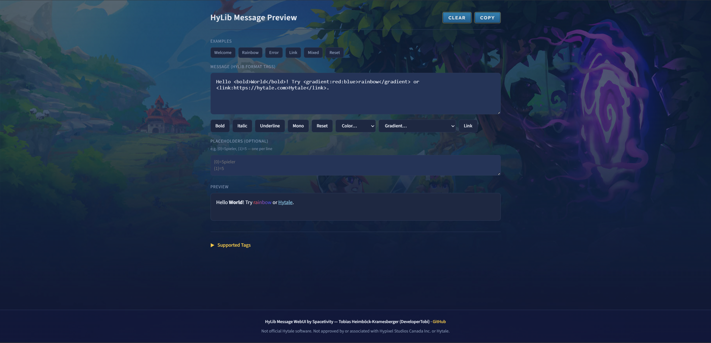
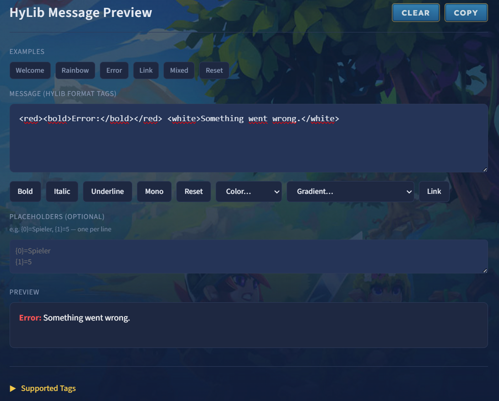
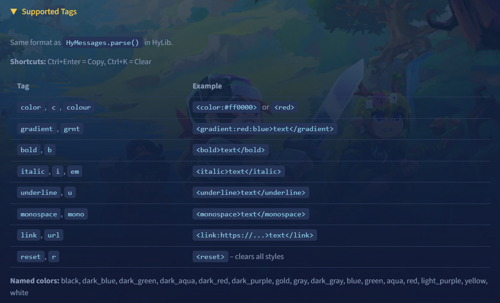
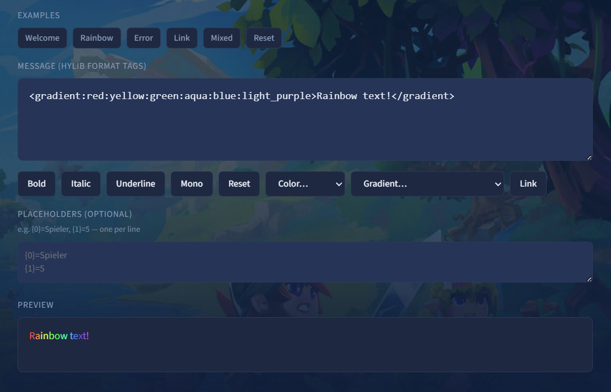

# HyLib Message WebUI

A live preview tool for HyLib format tags. Supports the same format as `HyMessages.parse()` and `MessageParserImpl` in HyLib.

<div align="center">

<table>
  <tr>
    <td align="center">
      
      <br><strong>Main Interface</strong>
    </td>
    <td align="center">
      
      <br><strong>Preview Example</strong>
    </td>
  </tr>
  <tr>
    <td align="center">
      
      <br><strong>Color Tags</strong>
    </td>
    <td align="center">
      
      <br><strong>Gradient Tags</strong>
    </td>
  </tr>
</table>

</div>

## Features

- Real-time preview of HyLib message formatting
- Share formatted messages via URL
- Copy formatted tag strings
- Supports all HyLib message tags

## Quick Start

### Development

```bash
npm install
npm run dev    # Starts dev server at http://localhost:5173
npm run build  # Builds for production (output: dist/)
npm run preview # Preview production build
```

## Supported Tags

| Tag | Aliases | Example |
|-----|---------|---------|
| `color` | `c`, `colour` | `<color:#ff0000>` or `<red>` |
| `gradient` | `grnt` | `<gradient:red:blue>text</gradient>` |
| `bold` | `b` | `<bold>text</bold>` |
| `italic` | `i`, `em` | `<italic>text</italic>` |
| `underline` | `u` | `<underline>text</underline>` |
| `monospace` | `mono` | `<monospace>text</monospace>` |
| `link` | `url` | `<link:https://...>text</link>` |
| `reset` | `r` | `<reset>` – clears all styles |

### Named Colors

`black`, `dark_blue`, `dark_green`, `dark_aqua`, `dark_red`, `dark_purple`, `gold`, `gray`, `dark_gray`, `blue`, `green`, `aqua`, `red`, `light_purple`, `yellow`, `white`

## Sharing

Messages can be shared via URL hash: `#m=encoded_text`. Use the Copy button to copy the raw tag string.

## Deployment

The WebUI can be deployed using Docker with automatic SSL via Caddy.

### Prerequisites

- Docker and Docker Compose installed on your server
- A domain name pointing to your server's public IP (DNS A record)
- Ports 80 and 443 accessible from the internet

### Cloudflare DNS Configuration

If you're using Cloudflare for DNS, add the following DNS record:

1. **Go to Cloudflare Dashboard** → Select your domain → DNS → Records
2. **Add an A Record:**
   - **Type:** A
   - **Name:** `webui` (or your desired subdomain)
   - **IPv4 address:** Your server's public IP address
   - **Proxy status:** **DNS only** (gray cloud icon) - **IMPORTANT!**
   - **TTL:** Auto
3. **Click Save**

**Important:** The proxy must be **disabled** (DNS only / gray cloud) for Let's Encrypt SSL certificate generation to work. Caddy needs direct access to your server on ports 80 and 443 for the ACME HTTP-01 challenge.

After adding the DNS record, wait a few minutes for DNS propagation, then proceed with the deployment setup.

### Quick Setup

#### Option 1: Automated Setup Script

**If you have the repository cloned:**
```bash
cd /path/to/HyLib-webui/deploy
chmod +x setup-server.sh
./setup-server.sh
```

**If downloading from GitHub:**
```bash
# Download the setup script
curl -L -o setup-server.sh https://raw.githubusercontent.com/Spacetivity/HyLib-webui/production/deploy/setup-server.sh

# Verify it's a valid script (should start with #!/bin/bash)
head -n 1 setup-server.sh

# If valid, run it
chmod +x setup-server.sh
mkdir -p deploy
cd deploy
../setup-server.sh
```

**Note:** If you get a "404: command not found" error, the download failed and you got an HTML error page instead of the script. In that case:
1. Clone the repository: `git clone https://github.com/Spacetivity/HyLib-webui.git`
2. Copy `deploy/setup-server.sh` to your server
3. Or use Option 2 to create the files manually

The script will create all necessary configuration files in the `deploy/` directory.

#### Option 2: Manual Setup

Create the following files in the `deploy/` directory:

**1. docker-compose.yml:**

```yaml
services:
  webui:
    image: ghcr.io/spacetivity/hylib-webui:${WEBUI_TAG:-latest}
    restart: unless-stopped
    pull_policy: always

  caddy:
    image: caddy:alpine
    restart: unless-stopped
    ports:
      - "80:80"
      - "443:443"
    environment:
      DOMAIN: ${DOMAIN:-webui.spacetivity.dev}
    volumes:
      - ./Caddyfile:/etc/caddy/Caddyfile:ro
      - caddy_data:/data
    depends_on:
      - webui

volumes:
  caddy_data:
```

**2. Caddyfile:**

```caddyfile
{
    email your-email@example.com
}

{$DOMAIN} {
    reverse_proxy webui:80
}
```

Replace `your-email@example.com` with your email address for Let's Encrypt notifications.

**3. .env:**

```bash
DOMAIN=webui.spacetivity.dev
WEBUI_TAG=latest
```

Replace `webui.spacetivity.dev` with your domain name.

### Starting the Services

```bash
cd deploy
docker compose up -d
```

Caddy will automatically obtain an SSL certificate from Let's Encrypt on first start. Your site will be available at `https://your-domain.com` once the certificate is issued.

### Managing the Deployment

**View logs:**
```bash
docker compose logs -f
```

**Update to latest version:**
```bash
docker compose pull && docker compose up -d
```

**Stop services:**
```bash
docker compose down
```

### Docker Image

Docker images are automatically built and pushed to GitHub Container Registry (`ghcr.io/spacetivity/hylib-webui`) when:
- Code is pushed to the `production` branch
- Pull requests are merged into `production`
- Manually triggered via GitHub Actions workflow

The image is tagged as `latest` for the production branch.

### Troubleshooting

**SSL Certificate Issues (ERR_SSL_PROTOCOL_ERROR / SSL_ERROR_INTERNAL_ERROR_ALERT):**

1. **Check Cloudflare Proxy Status:**
   - Go to Cloudflare Dashboard → DNS → Records
   - Ensure the A record has **DNS only** (gray cloud), NOT proxied (orange cloud)
   - If proxied, click the cloud icon to disable proxy
   - Wait 5-10 minutes for changes to propagate

2. **Verify DNS Resolution:**
   ```bash
   # Check if DNS points to your server
   dig webui.spacetivity.dev +short
   # Should return your server's IP address
   ```

3. **Check Caddy Logs:**
   ```bash
   cd deploy
   docker compose logs caddy
   ```
   Look for errors like:
   - "acme: error" - Certificate generation failed
   - "connection refused" - Ports not accessible
   - "timeout" - DNS or network issues

4. **Verify Ports are Accessible:**
   ```bash
   # From another machine, test if ports are open
   curl -I http://webui.spacetivity.dev
   # Should return HTTP response, not connection refused
   ```

5. **Check .env File:**
   ```bash
   cd deploy
   cat .env
   # Ensure DOMAIN matches your actual domain
   ```

6. **Restart Caddy Container:**
   ```bash
   cd deploy
   docker compose restart caddy
   docker compose logs -f caddy
   ```

7. **If Still Failing - Manual Certificate Check:**
   - Ensure firewall allows ports 80 and 443
   - Verify your server's public IP matches the DNS A record
   - Try accessing `http://webui.spacetivity.dev` (HTTP, not HTTPS) - should redirect or show Caddy error page

**Container Won't Start:**
- Check logs: `docker compose logs`
- Verify `.env` file exists and contains valid values
- Ensure Docker has enough resources allocated

**Updates Not Working:**
- Pull latest image: `docker compose pull`
- Restart containers: `docker compose up -d`
- Check image tag in `.env` matches available tags

## Project Structure

```
├── src/           # Source code
├── deploy/        # Docker deployment configuration
└── dist/          # Build output (generated)
```

## Notes

- SSL certificates are stored in the `caddy_data` volume and automatically renewed
- The WebUI container runs on port 80 internally; external access is through Caddy on ports 80/443
- All configuration files can be edited and changes take effect after restarting containers
